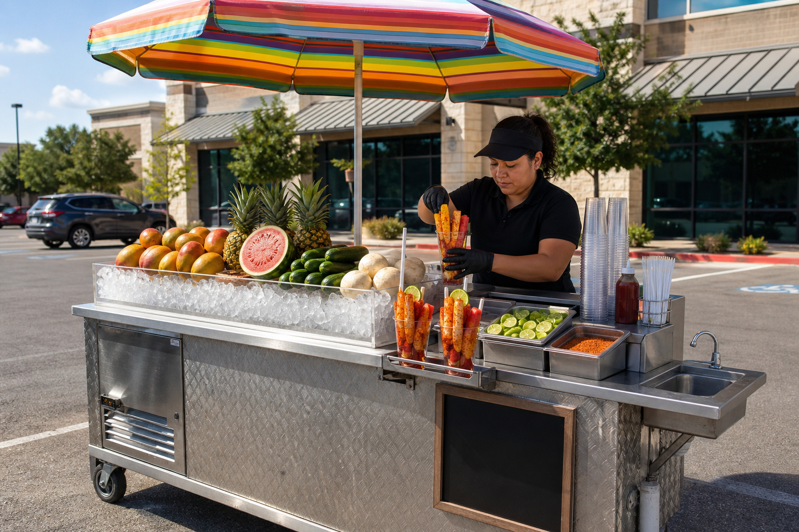
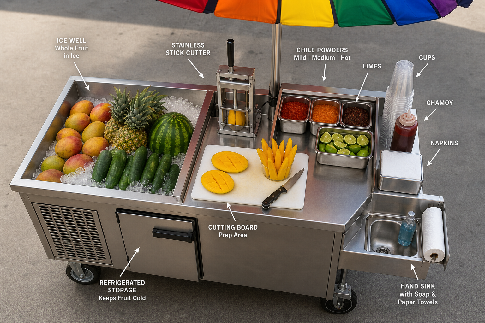
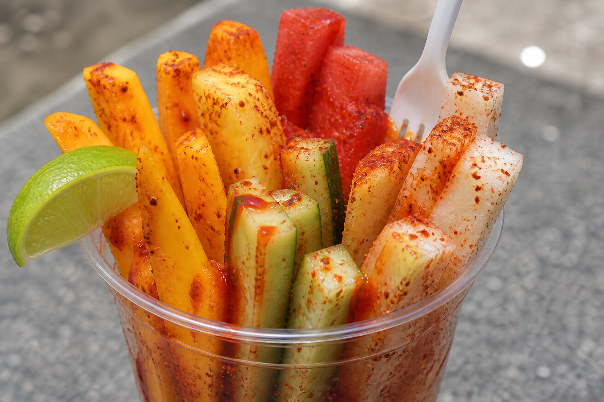

# Visual mockup: how the cart works

Concept shots for the San Antonio launch. Rainbow umbrella and fruit on ice from Mexican street carts. Mechanical fridge, hand sink, and a 20–40 second finish in front of the customer — that is what makes it legal and repeatable.

## The cart

Private-property lunch pad (gym / hospital / campus lot). Not a sidewalk next to an existing *frutero*.

**Kept from street carts:** loud umbrella, whole fruit packed in ice, standing spears in a clear cup, chile-lime and chamoy, stainless chassis.

**Added for a Type II unit:** mechanical fridge (cut melon at ≤41°F), integral hand sink, commissary wash/core in the morning, finish-to-order instead of packed cups sitting in the sun.

## Top layout

Customer faces the ice well. Operator works the finish edge. Fruit that is already cut lives in the fridge, not on the ice.

| Zone | Job |
| --- | --- |
| Ice well | The sell. Whole mango, pineapple, melon, cucumber, jícama. Theater, not the cold hold. |
| Finish station | Spear jig, pack, fresh lime, chile-lime salt, optional chamoy. 20–40 seconds. |
| Fridge | TCS hold ≤41°F. Lidded cambros, time labels, temp log. Discard leftover cut melon at close. |
| Hand sink | Pressurized hot and cold. Cutting on a folding table is a shutdown. |
| Tanks | Potable in; wastewater ≥15% larger. Dumped at the commissary every operating day. |

## The cup

16 oz mixed, about $10. Spears that stand, not grocery cubes. Lime and chile-lime always. Chamoy +$1.

Launch mix: watermelon, pineapple, mango, cucumber, jícama. When mango spikes, drop it that week.

## A day (hybrid)

1. **5:30** — Zarzamora terminal or SAWPM. Buy for the day.
2. **7:00** — Commissary: wash, core pineapple, wedge melon, peel cucumber/jícama, ice, load, log temps.
3. **9:30–2:30** — Lunch pad. Final spear, pack, finish, tap to pay.
4. **3:30** — Optional heat shift. One excellent lunch is enough to validate.
5. **7:30** — Commissary close: dump tanks, wash cart, throw leftover cut melon, store whole fruit.

Full operating plan: [working-model.md](working-model.md). Money: [unit-economics.md](unit-economics.md).
